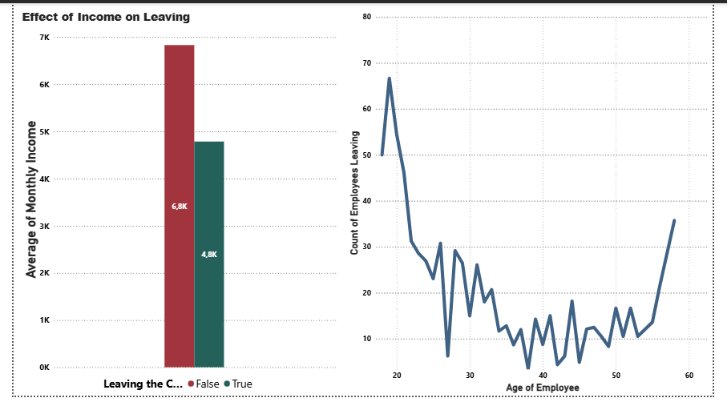
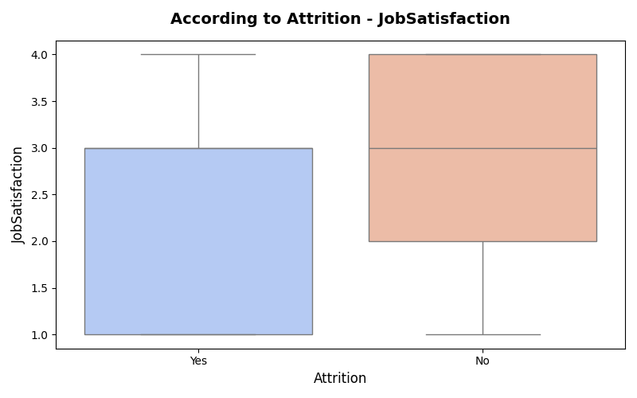

# HR_Data_Analysis

This project examined employee attrition rates and the factors influencing these rates using IBM's HR data. Using exploratory data analysis (EDA) and machine learning methods, employee turnover risk was estimated. Additionally, analysis such as job satisfaction, gender, education level, etc., are also included.  
/  
Questo progetto ha esaminato i tassi di abbandono dei dipendenti e i fattori che li influenzano utilizzando i dati HR di IBM. Utilizzando l'analisi esplorativa dei dati (EDA) e metodi di apprendimento automatico, è stato stimato il rischio di turnover dei dipendenti. Inoltre, sono incluse anche analisi quali soddisfazione lavorativa, genere, livello di istruzione, ecc.

---

## Purpose of the Project / Obiettivo del Progetto

- Analyze employee attrition rates.  
- Discover factors affecting turnover rates (age, department, overtime, etc.).  
- Predict attrition risk using machine learning models.  
- Additional general informative analyses were made with the data we have.  
/  
- Analizzare i tassi di abbandono dei dipendenti.  
- Individuare i fattori che influenzano i tassi di turnover (età, reparto, straordinari, ecc.).  
- Prevedere il rischio di abbandono utilizzando modelli di apprendimento automatico.  
- Sono state effettuate ulteriori analisi informative generali con i dati a nostra disposizione.

---

## Programs and Extensions Used / Programmi ed Estensioni Utilizzati

- **Python**: For data analysis and modeling.  
- **Pandas** and **NumPy**: Data manipulation.  
- **Matplotlib**, **Seaborn**: Data visualization.  
- **Scikit-learn**: Machine learning models.  
- **Power BI**: Visualizations and dashboards.  
/  
- **Python**: per l'analisi dei dati e la modellazione.  
- **Pandas** e **NumPy**: manipolazione dei dati.  
- **Matplotlib**, **Seaborn**: visualizzazione dei dati.  
- **Scikit-learn**: modelli di apprendimento automatico.  
- **Power BI**: visualizzazioni e dashboard.

---

## Data Set

**Data source link**: [IBM HR Analytics Attrition Dataset - Kaggle](https://www.kaggle.com/datasets/pavansubhasht/ibm-hr-analytics-attrition-dataset)

The project was implemented using the **IBM HR Analytics Attrition** dataset. This dataset includes employee attrition status and various demographic information.  
/  
Il progetto è stato realizzato utilizzando il set di dati **IBM HR Analytics Attrition**. Questo set di dati include lo stato di abbandono dei dipendenti e varie informazioni demografiche.

---

## Analysis / Analisi

- **Exploratory Data Analysis (EDA)**: Examining the overall structure and relationships of data.  
- **Machine Learning Models**: Decision trees and regression models for predicting employee attrition risk.  
- **Descriptive analysis** (attrition rates, distributions)  
- **Correlation analysis**  
- **Forecasting (ML)**  
- **Clustering**  
- **Time series analysis**  
/  
- **Analisi esplorativa dei dati (EDA)**: esame della struttura complessiva e delle relazioni dei dati.  
- **Modelli di apprendimento automatico**: alberi decisionali e modelli di regressione per prevedere il rischio di abbandono dei dipendenti.  
- **Analisi descrittiva** (tassi di abbandono, distribuzioni)  
- **Analisi di correlazione**  
- **Previsioni (ML)**  
- **Clustering**  
- **Analisi delle serie temporali**

---

# Results & Analysis / Risultati e Analisi

> This file presents detailed analysis results and model evaluations for the HR attrition prediction project.

## Key Findings / Risultati Chiave

- **Employee Attrition**: Age and job satisfaction emerged as key factors. Employees aged **30–40** with **low job satisfaction** showed a higher risk of attrition.  
  - **Abbandono dei dipendenti**: L’età e la soddisfazione lavorativa sono risultati fattori chiave. I dipendenti tra i **30 e i 40 anni** con **bassa soddisfazione lavorativa** mostrano un rischio maggiore di abbandono.

- **Department-wise Attrition**: The **Sales** department had the highest attrition rate.  
  - **Abbandono per dipartimento**: Il reparto **vendite** ha registrato il tasso di abbandono più elevato.

- **Model Performance**: Without addressing class imbalance, models failed to effectively detect attrition. After applying **SMOTE**, both **Decision Tree** and **Logistic Regression** showed improved recall for attrition cases.  
  - **Prestazioni del modello**: I modelli iniziali non hanno rilevato efficacemente l’abbandono. Dopo l’applicazione di **SMOTE**, sia il modello **Decision Tree** che la **Regressione Logistica** hanno mostrato miglioramenti nel recall dei casi di abbandono.

---

## 1. Exploratory Data Analysis (EDA) / Analisi Esplorativa dei Dati

We explored attrition rates by age, department, overtime, job role, etc. Key observations included:

- High attrition in Sales and Human Resources departments
- Strong correlation between overtime and attrition
- Low job satisfaction often associated with attrition

Abbiamo esaminato i tassi di abbandono per età, reparto, straordinari, ruolo, ecc. Le osservazioni chiave includono:

- Alto tasso di abbandono in Vendite e Risorse Umane
- Forte correlazione tra straordinari e abbandono
- Bassa soddisfazione lavorativa spesso associata all’abbandono

*📌 Suggestion: Include visualizations like heatmaps, bar plots, and box plots here if you have them.*

---

## 2.Demographic & Behavioral Insights from Power BI  / Approfondimenti Demografici e Comportamentali da Power BI

These insights were derived using Power BI visualizations.  
Queste informazioni sono state ottenute utilizzando visualizzazioni in Power BI.

- **Attrition by Gender**:  
  - Female employees: **14.80%** attrition  
  - Male employees: **17.01%** attrition  
  - → Male employees appear slightly more likely to leave.  
  - **Abbandono per genere**:  
    - Donne: **14,80%**  
    - Uomini: **17,01%**  
    - → Gli uomini sembrano leggermente più propensi a lasciare l'azienda.

- **Income by Gender**:  
  - Number of high-income employees:  
    - Women: **558**  
    - Men: **882**  
  - **Reddito per genere**:  
    - Donne: **558**  
    - Uomini: **882**

- **Monthly Income Comparison**:  
  - Attrition cases: average monthly income ≈ **4.8K**  
  - Retained employees: average monthly income ≈ **6.8K**  
  - → Lower income levels are linked with higher attrition.  
  - **Confronto reddito mensile**:  
    - Casi di abbandono: ≈ **4.8K**  
    - Dipendenti rimasti: ≈ **6.8K**  
    - → I redditi inferiori sono associati a maggiore abbandono.

- **Business Travel Impact**:  
  - Travel Frequently: **24.91%** attrition  
  - Travel Rarely: **14.96%** attrition  
  - Non-Travel: **0.8%** attrition  
  - → Frequent travel may contribute to burnout and higher attrition.  
  - **Impatto dei viaggi di lavoro**:  
    - Viaggi frequenti: **24,91%**  
    - Viaggi occasionali: **14,96%**  
    - Nessun viaggio: **0,8%**  
    - → I viaggi frequenti possono contribuire al burnout e all'abbandono.

--- 

## 3. Power BI Visualizations

> Below are key visualizations created using Power BI for the HR Attrition dataset.  
> Di seguito sono riportate le principali visualizzazioni create con Power BI per il dataset di abbandono HR.

<strong>Click to expand / Clicca per espandere</strong>

###  General Attrition Trends

  
  
  

###  Department & Role Analysis

  

###  Job Satisfaction & Overtime

  

---

## 4. Python Visualizations

> Visualizations created using Python libraries like Seaborn and Matplotlib.  
> Visualizzazioni create utilizzando librerie Python come Seaborn e Matplotlib.

<strong>Click to expand / Clicca per espandere</strong>

###  Decision Tree

  
*Decision tree visualization used for attrition prediction.*  
*Visualizzazione dell'albero decisionale usata per la previsione dell'abbandono.*

###  Turnover Rate by Department

  
*Attrition rates across different departments.*  
*Tassi di abbandono nei vari reparti.*

###  General Overview Plots

  
  
  
  
*General exploratory data analysis plots.*  
*Grafici generali di analisi esplorativa dei dati.*

###  Attrition Distribution

  
*Distribution of attrition cases.*  
*Distribuzione dei casi di abbandono.*

###  Travel Distribution

  
*Employee distribution by business travel frequency.*  
*Distribuzione dei dipendenti in base alla frequenza dei viaggi di lavoro.*

###  Education Level

  
*Attrition analysis by education level.*  
*Analisi dell'abbandono per livello di istruzione.*

###  Job Role

  
*Attrition by job role.*  
*Abbandono per ruolo lavorativo.*

###  Overtime

  
*Impact of overtime on attrition.*  
*Impatto degli straordinari sull'abbandono.*

###  Marital Status

  
*Attrition by marital status.*  
*Abbandono in base allo stato civile.*

###  Age

  
*Attrition rates across age groups.*  
*Tassi di abbandono per fasce d'età.*

###  Monthly Income

  
*Attrition in relation to monthly income.*  
*Abbandono in relazione al reddito mensile.*

###  Distance from Home

  
*Effect of distance from home on attrition.*  
*Effetto della distanza da casa sull'abbandono.*

###  Job Satisfaction

  
*Attrition based on job satisfaction levels.*  
*Abbandono basato sui livelli di soddisfazione lavorativa.*

###  Years at Company

  
*Attrition by tenure at the company.*  
*Abbandono in base agli anni di servizio.*

###  Business Travel

  
*Attrition by business travel frequency.*  
*Abbandono in base alla frequenza dei viaggi di lavoro.*

###  Correlation Matrix

  
*Correlation heatmap of features.*  
*Heatmap di correlazione delle variabili.*

---

## Notes

- You can always reorganize or remove visualizations as needed.  
- Make sure all file names and paths match exactly with what’s in your repository folders.

## 5. Machine Learning Models / Modelli di Apprendimento Automatico

### 5.1 Without SMOTE / Senza SMOTE

| Model               | Accuracy | Precision (Attrition) | Recall (Attrition) | F1 Score (Attrition) |
|---------------------|----------|------------------------|--------------------|----------------------|
| Decision Tree        | 0.77     | 0.16                   | 0.18               | 0.17                 |
| Logistic Regression  | 0.86     | 0.38                   | 0.08               | 0.13                 |

> ❗ These models had high overall accuracy but **very low recall** for attrition cases due to **class imbalance**.
>  
> Questi modelli avevano un'alta accuratezza complessiva, ma un **recall molto basso** per i casi di abbandono a causa dello **sbilanciamento delle classi**.

---

### 5.2 With SMOTE / Con SMOTE

After applying SMOTE to balance the class distribution:

| Model                      | Accuracy | Precision (Attrition) | Recall (Attrition) | F1 Score (Attrition) |
|----------------------------|----------|------------------------|--------------------|----------------------|
| Decision Tree (SMOTE)      | 0.73     | 0.20                   | 0.33               | 0.25                 |
| Logistic Regression (SMOTE)| 0.75     | 0.25                   | 0.44               | 0.32                 |

>  **Recall improved significantly**, making models more useful for identifying potential attrition.
>  
>  Il **recall è migliorato notevolmente**, rendendo i modelli più utili per identificare il rischio di abbandono.

---

## 6. Discussion / Discussione

- SMOTE successfully addressed class imbalance, improving model sensitivity to attrition.
- Logistic Regression with SMOTE showed the **best recall (44%)**, making it suitable for identifying potential leavers.
- While accuracy decreased slightly, this trade-off is acceptable when **detecting rare events** like employee attrition.

- SMOTE ha risolto il problema dello sbilanciamento, migliorando la sensibilità dei modelli.
- La Regressione Logistica con SMOTE ha ottenuto il **miglior recall (44%)**, risultando adatta per identificare i dipendenti a rischio.
- Sebbene l'accuratezza sia leggermente diminuita, questo compromesso è accettabile nella **rilevazione di eventi rari**.

---

## 7. Limitations and Future Work / Limitazioni e Lavori Futuri

- The dataset only covers IBM employees; generalizability to other organizations is uncertain.
- Only basic ML models (Decision Tree, Logistic Regression) were used.  
- Future work can explore:
  - Advanced models (Random Forest, XGBoost)
  - Feature engineering
  - Hyperparameter tuning
  - Better interpretability tools (e.g., SHAP values)

- Il dataset copre solo i dipendenti IBM; la generalizzazione ad altre aziende non è garantita.
- Sono stati utilizzati solo modelli base (Decision Tree, Logistic Regression).  
- I lavori futuri possono esplorare:
  - Modelli avanzati (Random Forest, XGBoost)
  - Feature engineering
  - Ottimizzazione degli iperparametri
  - Strumenti di interpretazione migliori (es. SHAP)

---

*🔗 For full implementation, code, and visualizations, refer to the Jupyter notebooks in the project repository.*  
*🔗 Per l'implementazione completa, il codice e le visualizzazioni, consultare i notebook del progetto.*

---
## Ethics and Data Privacy / Etica e Privacy dei Dati

The data used in this project includes anonymized employee information. Confidentiality and security of data are prioritized.  
/  
I dati utilizzati in questo progetto includono informazioni anonime sui dipendenti. La riservatezza e la sicurezza dei dati sono prioritarie.
