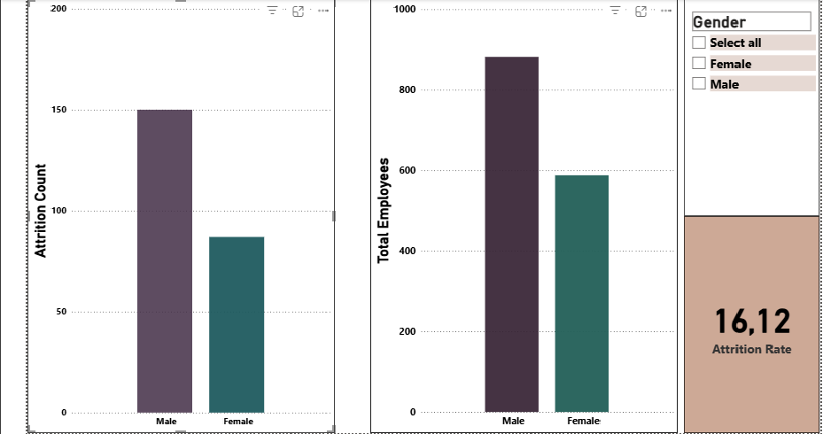
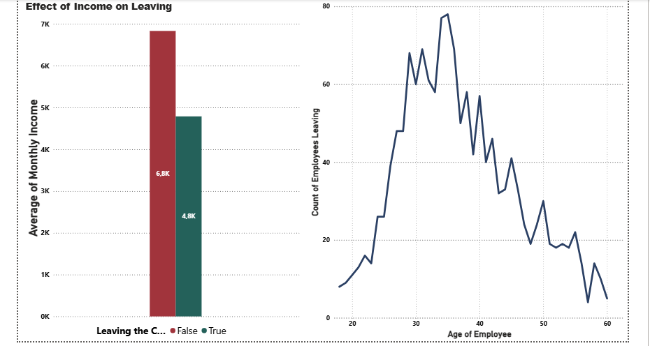

# HR_Data_Analysis

This project examined employee attrition rates and the factors influencing these rates using IBM's HR data. Using exploratory data analysis (EDA) and machine learning methods, employee turnover risk was estimated. Additionally, analysis such as job satisfaction, gender, education level, etc., are also included.  
/  
Questo progetto ha esaminato i tassi di abbandono dei dipendenti e i fattori che li influenzano utilizzando i dati HR di IBM. Utilizzando l'analisi esplorativa dei dati (EDA) e metodi di apprendimento automatico, è stato stimato il rischio di turnover dei dipendenti. Inoltre, sono incluse anche analisi quali soddisfazione lavorativa, genere, livello di istruzione, ecc.

---

## Purpose of the Project / Obiettivo del Progetto

- Analyze employee attrition rates.  
- Discover factors affecting turnover rates (age, department, overtime, etc.).  
- Predict attrition risk using machine learning models.  
- Additional general informative analyses were made with the data we have.  
/  
- Analizzare i tassi di abbandono dei dipendenti.  
- Individuare i fattori che influenzano i tassi di turnover (età, reparto, straordinari, ecc.).  
- Prevedere il rischio di abbandono utilizzando modelli di apprendimento automatico.  
- Sono state effettuate ulteriori analisi informative generali con i dati a nostra disposizione.

---

## Programs and Extensions Used / Programmi ed Estensioni Utilizzati

- **Python**: For data analysis and modeling.  
- **Pandas** and **NumPy**: Data manipulation.  
- **Matplotlib**, **Seaborn**: Data visualization.  
- **Scikit-learn**: Machine learning models.  
- **Power BI**: Visualizations and dashboards.  
/  
- **Python**: per l'analisi dei dati e la modellazione.  
- **Pandas** e **NumPy**: manipolazione dei dati.  
- **Matplotlib**, **Seaborn**: visualizzazione dei dati.  
- **Scikit-learn**: modelli di apprendimento automatico.  
- **Power BI**: visualizzazioni e dashboard.

---

## Data Set

**Data source link**: [IBM HR Analytics Attrition Dataset - Kaggle](https://www.kaggle.com/datasets/pavansubhasht/ibm-hr-analytics-attrition-dataset)

The project was implemented using the **IBM HR Analytics Attrition** dataset. This dataset includes employee attrition status and various demographic information.  
/  
Il progetto è stato realizzato utilizzando il set di dati **IBM HR Analytics Attrition**. Questo set di dati include lo stato di abbandono dei dipendenti e varie informazioni demografiche.

---

## Analysis / Analisi

- **Exploratory Data Analysis (EDA)**: Examining the overall structure and relationships of data.  
- **Machine Learning Models**: Decision trees and regression models for predicting employee attrition risk.  
- **Descriptive analysis** (attrition rates, distributions)  
- **Correlation analysis**  
- **Forecasting (ML)**  
- **Clustering**  
- **Time series analysis**  
/  
- **Analisi esplorativa dei dati (EDA)**: esame della struttura complessiva e delle relazioni dei dati.  
- **Modelli di apprendimento automatico**: alberi decisionali e modelli di regressione per prevedere il rischio di abbandono dei dipendenti.  
- **Analisi descrittiva** (tassi di abbandono, distribuzioni)  
- **Analisi di correlazione**  
- **Previsioni (ML)**  
- **Clustering**  
- **Analisi delle serie temporali**

---

## Results & Analysis / Risultati e Analisi

For a detailed discussion of the analysis and results, please refer to the [Results Analysis](results.md) document.  
Per una discussione dettagliata dell'analisi e dei risultati, fare riferimento al documento [Risultati e Analisi](results.md).

**Performance metrics for attrition prediction models after applying SMOTE:**

| Model                      | Accuracy | Recall (Attrition) |
|---------------------------|----------|---------------------|
| Decision Tree (SMOTE)     | 0.73     | 0.33                |
| Logistic Regression (SMOTE) | 0.75    | 0.44                |

---

###  Attrition by Gender (Power BI)

**EN**: Female attrition: **14.80%**, Male attrition: **17.01%**  
→ Male employees show a slightly higher turnover rate.

**IT**: Abbandono tra le donne: **14,80%**, tra gli uomini: **17,01%**  
→ I dipendenti di sesso maschile mostrano un tasso di abbandono leggermente più alto.

###  Attrition by Business Travel (Power BI)

**EN**: Employees who travel frequently have the highest attrition rate (**24.91%**),  
while those who never travel show the lowest (**0.8%**).  
→ Frequent travel may lead to fatigue and higher turnover.

**IT**: I dipendenti che viaggiano frequentemente hanno il tasso di abbandono più alto (**24,91%**),  
mentre chi non viaggia quasi mai mostra il più basso (**0,8%**).  
→ I viaggi frequenti possono causare stress e aumentare l’abbandono.

### Attrition by Monthly Income (Power BI)

**EN**: Employees who left earned on average **4.8K**, while retained employees earned **6.8K**.  
→ Lower income levels are linked to higher attrition risk.

**IT**: I dipendenti che hanno lasciato l'azienda guadagnavano in media **4.8K**,  
mentre quelli rimasti guadagnavano **6.8K**.  
→ Un reddito più basso è associato a un rischio maggiore di abbandono.

---
## Ethics and Data Privacy / Etica e Privacy dei Dati

The data used in this project includes anonymized employee information. Confidentiality and security of data are prioritized.  
/  
I dati utilizzati in questo progetto includono informazioni anonime sui dipendenti. La riservatezza e la sicurezza dei dati sono prioritarie.
